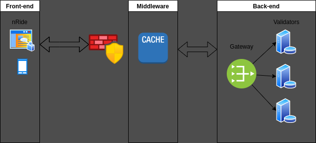
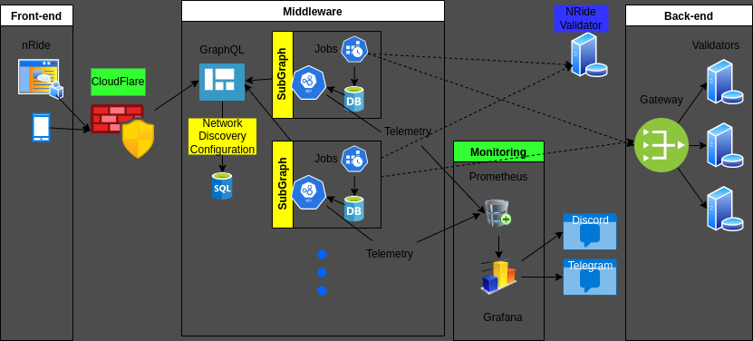
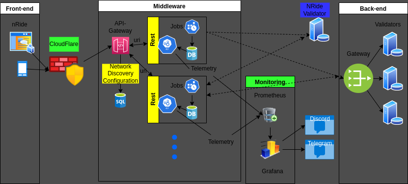

# ADR 001: Upgrade Middleware

## Changelog

* 2023-07-17: First Draft

## Status

PROPOSED

## Abstract

The current front end requires to do multiple queries to different sources to get the corresponding data need it to display the information. This ADR describes
how we can refactor the middleware to decouple the frontend querying information system from the backend.

## Context

The front end requires making different queries to sources that can have different response times.
This produces a delayed effect on the front end displaying the data. 
We also want to design the middleware to be:

* Reliable/Available (continuing to work correctly, even when things go wrong)
* Scalable (growth)
* Extensible
* Maintainable ( Operable, Simple, Evolve and testable)
* Secure

To improve the current situation, the middleware is being refactored using a cache in the middle between the front end and the blockchain validators.

## Proposals

### Graphql Service

### Rest Service

## Consequences

* **Rest Service** uses a different endpoint for each resource while **Graphql Service** only one.
* **Graphql Service** uses **strong type** ( schemas ).
* **Graphql Service** provides a **query SDL** that can customize the response **reducing data transmitted** in **one call** (No over-fetching and under-fetching problems).
* **Graphql Service** provides aggregation on the router part, allowing to merge entities (Hierarchical Structure).
* **Graphql Service** has an in-built introspection system. This allows you to query the schema and find out the kind of queries it supports.

* **Rest Service** requires less complexity and can provide caching based on resource path, while **Graphql Service** is done by a query.
* **Rest Service** can limit the rate via **API-Gateway**, while **Graphql Service** is done by query and is more complex.

> Notes

* firewall should also limit the rate to avoid DoS ( Cloudflare suggested).

## Decision

## Further Discussions

## References

* (rest - graphql comparison)[https://www.howtographql.com/basics/1-graphql-is-the-better-rest/]

## Glossary

